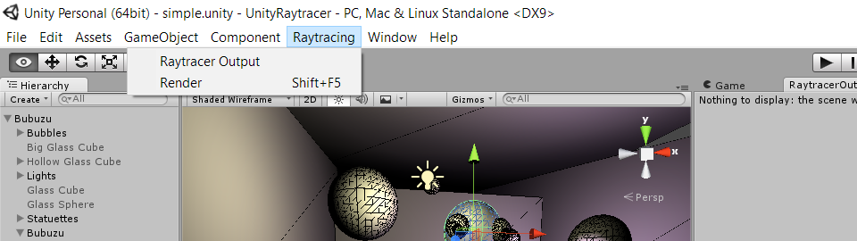
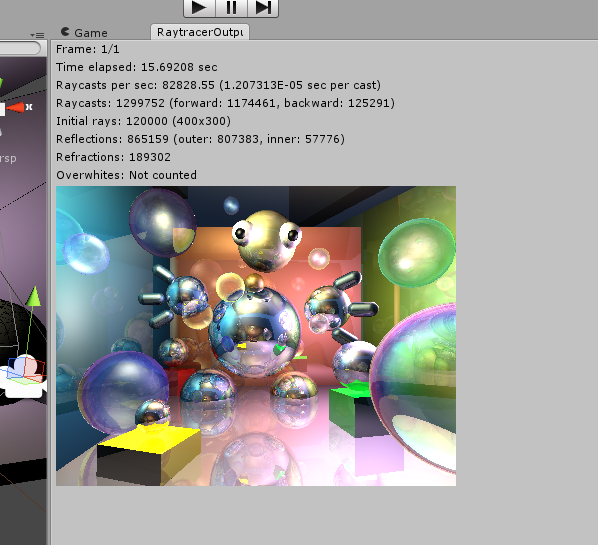
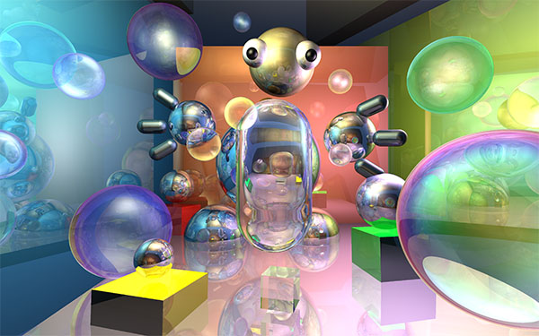
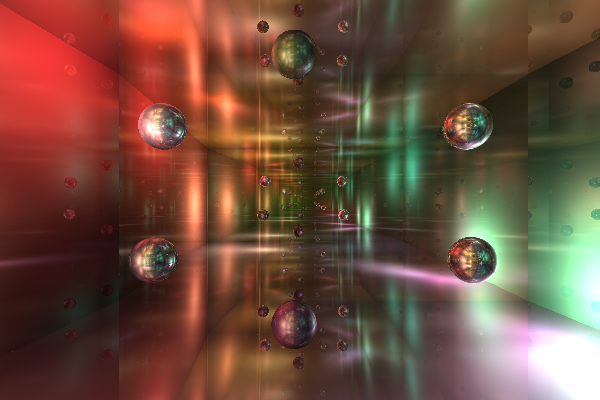
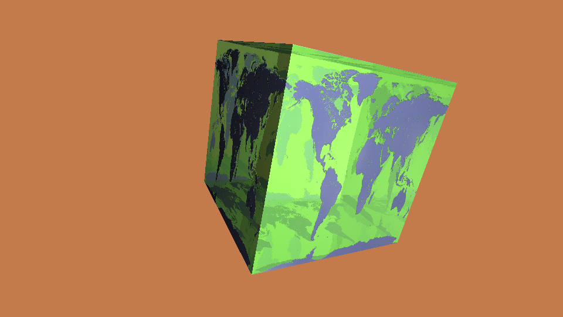

# Unity Ratracer #

Raytracer built on top of the PhysX raycasting methods.
It is capable of rendering diffuse/specular/reflective/refractive materials.

### How to render ###
- Open up the project in **Unity Editor**.
- Open `simple.unity` scene file from the **Project Explorer** window.
 
You'll notice that this project adds the `Raytracing` menu item to the main menu.

- Click `Raytracer Output` menu item to open the window that will display renderer output.
- Click `Render` or push `Shift+F5` hotkey to initiate rendering process.
Note that it can take a while!
Duration depends on complexity of the scene and output image resolution.
You'll hear beep sound when rendering is finished.

`Raytracer Output` window will display results of rendering:

### Examples of output: ###

